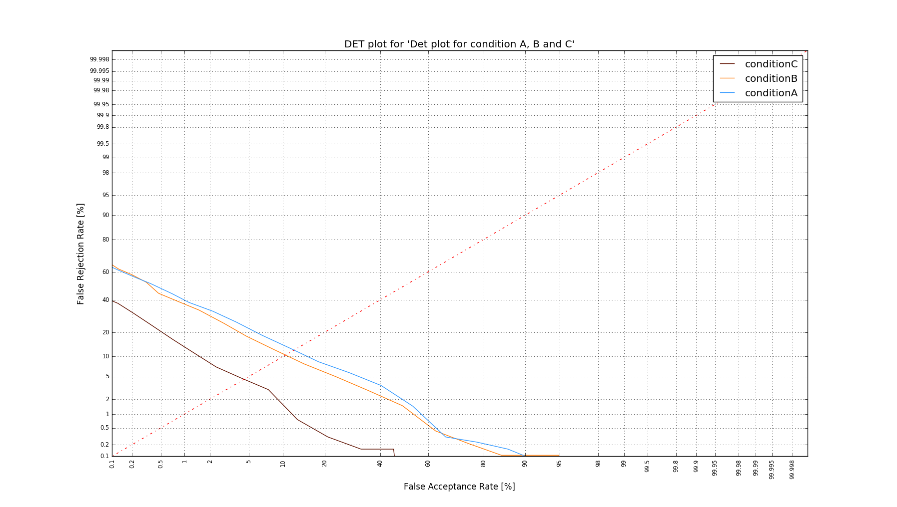
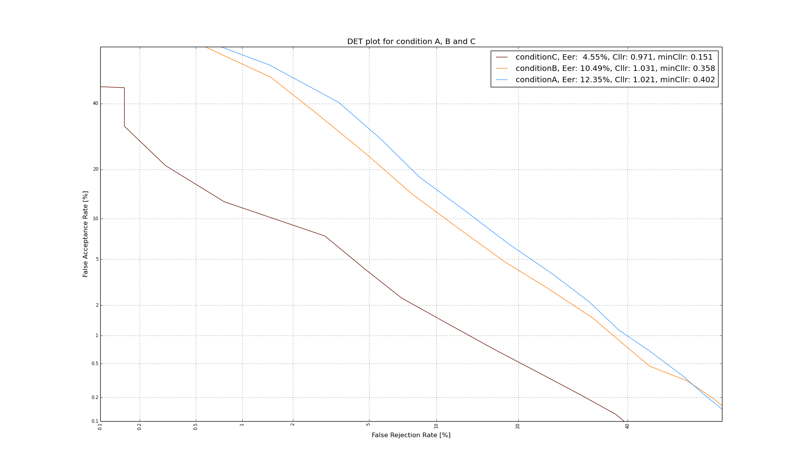

.. _rst_detplot:

DET plot
========

Will plot a detection error trade off plot or DET plot.

Example command: ::

    python ./bioplot.py -e "condition A, B and C" -i input/testdata_ABC.txt -D

If you want to see Cllr and minCllr values in the plot's legend, set: ::

    [det]
    showEer = True
    showCllr = True
    showMinCllr = True

You can set the upper limits for the False Accept rate and False Rejection Rate in the config file: ::

    [det]
    maxFalseAcceptRate = 60
    maxFalseRejectionRate = 60

Choose the limits from: ::

    0.001, 0.002, 0.005, 0.01, 0.02, 0.05, 0.1, 0.2, 0.5, 1, 2, 5, 10, 20, 40, 60, 80, 90, 95, 98, 99, 99.5,
    99.8, 99.9, 99.95, 99.98, 99.99, 99.995, 99.998, 99.999

By setting the limits you can show more detail in the plot area.

.. image:: images/detplot_with_diagonal.png

If you do not like to see a line on the diagonal of the plot by default, then choose this setting: ::

   [det]
   showDiagonal = False

If you want to print the plot to a file instead of to the screen, set printToFile accordingly.
The file name will be <experiment name>_det_plot.png. ::

        [cfg]
        printToFile = True
