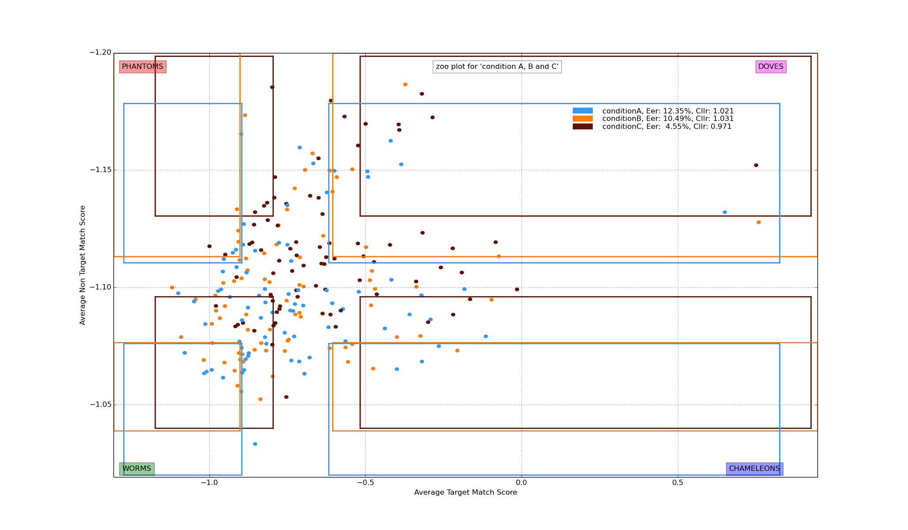
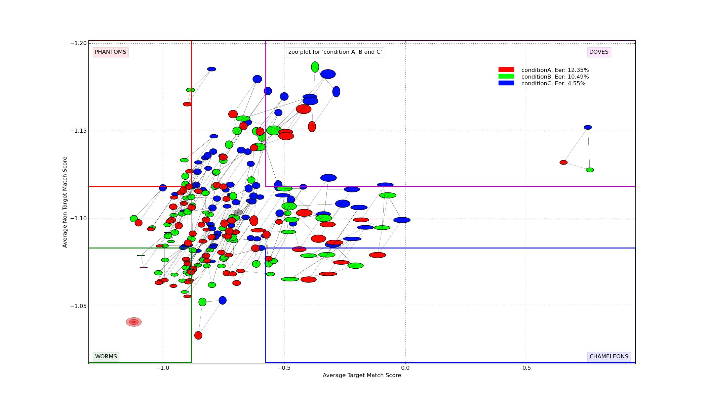
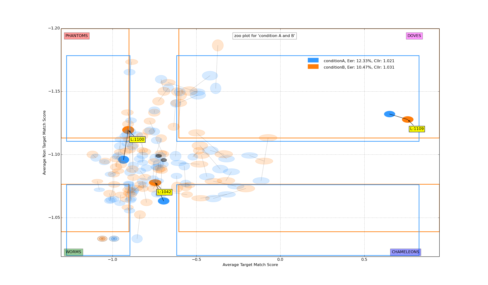
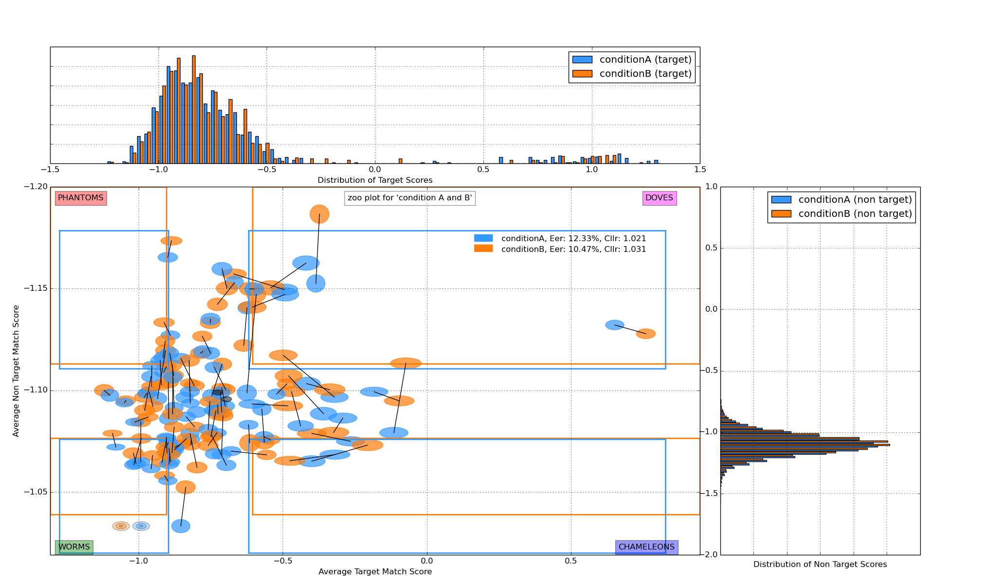
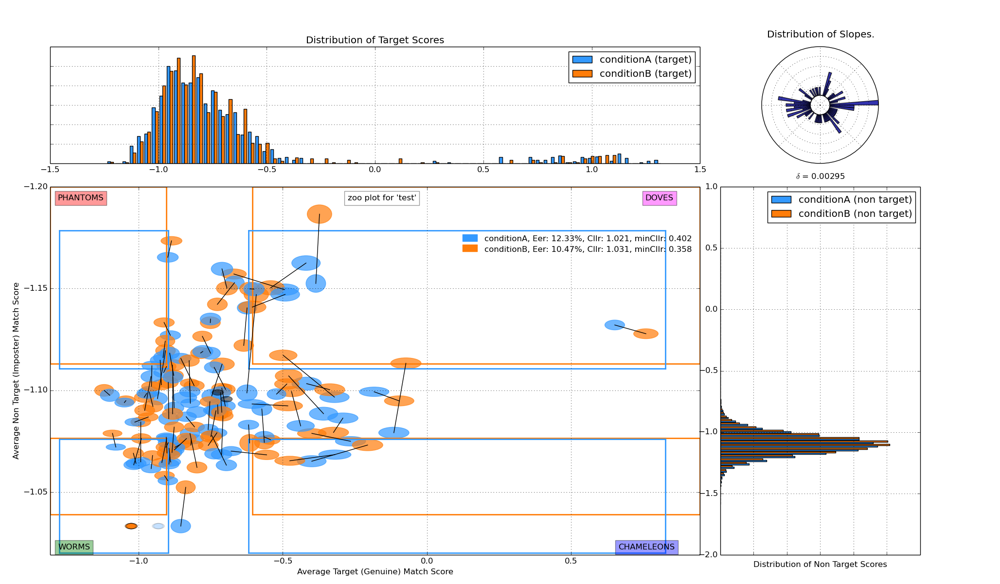

.. _rst_zooplot:

Zoo plot
========

Traditional plot
----------------
A zoo plot shows a scatter type plot where on the vertical axis the mean of the non target
scores and on the horizontal axis the mean target scores are drawn for each label. This leads to
a plot of dots where each dot represents the scores for one subject. The plot below shows an example with one dataset.
The zoo's special animals (points within quartile ranges) are coloured differently to make them stand out more.
Note: there must be at least one target and one non target score to be able to include a subject's data in the zoo plot.

Run this command: ::

    python ./bioplot.py -e "condition A" -i input/testdata_A.txt -Z

.. image:: images/condition_A_traditional_zoo_plot.png

You can combine multiple data sets in one plot. The next plot below shows combined data of 3 experiments (A, B and C).
The legend shows the eer and cllr values for the respective conditions. Note that each data set has its own quartile ranges.

Run this command: ::

    python ./bioplot.py -e "condition A, B and C" -i input/testdata_ABC.txt -Z

You can choose which error measures to show in the plot by setting any of the options below to true: ::

    [zoo]
    showCllr = True
    showEER = True
    showMinCllr = True

Tall thin animals
-----------------
An extention of the zoo plots was shown at the IAFPA 2014 conference in Zurich, Switserland
by Anil Alexander et al. They proposed that adding a measure of the standard deviations of the
scores used to make the plot will add details of the score distributions of the subjects
to the plot. If the option alexanderStyle in [zoo] is set to True, ellipses are drawn
at the positions where the points of a traditional zoo plot would be.
The width and height of the ellipses shown are essentially the standard deviations of the average
target and average non target scores for a given label. Because these may be much bigger or much
smaller than the horizontal and vertical scales of the traditional zoo plot, the mean standard
deviations are scaled by subtracting the overall mean standard deviation and dividing by the
standard deviation of all standard deviations. So they will be centered around zero.
This is in essence a normalization procedure.
The result will be ellipses with a unit width and height and ellipses smaller and bigger than that.
To be able to actually plot the normalised ellipses, the width is multiplied by the range of
scores on the horizontal axis and the height is multiplied by the range of the scores on the vertical axis.
Finally to scale the ellipses their width and height is divided by a scale factor.
This scale factor is related to the number of pixels in the display used to plot the zoo plot.
A value of 150 works nicely for a 1600 ... 1280x1024 display.
To get this type of plot set the following options in your settings file: ::

    [zoo]
    alexanderStyle = True
    scaleFactor = 150

Set the screen resolution in layout: ::

    [layout]
    screenResolution = 1600x1024

Note that in the data set there may be subjects with limited scores available. In case there is only one target score,
(or one non target score) one can not plot an ellipse for the corresponding axis.
In this case bioplot provides the option to either set the normalized std dev for this subject to the
minimum value which will result in a flat line for that dimension of the ellipse
or assume this subject is similar to other subjects and set the normalized std dev for this subject to the
unit value derived from the other subject target and non target scores. The default is to use the minimum value allowed. ::

    showSingleValueAsUnitValue = False

See also minStdDev in section [zoo] in bioplot.cfg.

Yager and Dunstone
------------------
Yager and Dunstone show the worms and chameleons at the bottom of the plot and the phantoms and doves above them.
This makes the vertical axis show lower scores at the top than at the bottom.
If you do not like this layout set yagerstyle to False in the config file (the default is True) and the vertical
axis will be reversed. ::

    [zoo]
    yagerstyle = True

Helper circles
--------------
Initially in a zoo plot helper ellipses are shown around the unit ellipse. If you resize the plot so that
they become circles, it will be easier to interpret the plotted data points and the shapes of the data points
will become independent of the screen dimensions. If you save a plot when resized in the way suggested you
will be able to compare zoo plots made from different data sets more easily. The helper ellipses will disappear as soon
as you click in the plot. Note, only if the std deviations of the average target scores are similar to standard
deviations of the average non target scores this will help. If this is not the case, then the ranges of the vertical
and horizontal axes differ too much to be able to resize the plot to a square.

.. image:: images/experiment_x_small.png

Colours
-------
If you don't like the colours used, specify your own list in the section [metacolours] of the settings file.
Different colours make it possible to combine multiple data sets in one plot.
Note: don't use white or some very light colour as the plot's
canvas is white and you would not see much of a label then.
From a perceptual point you should avoide pure Blue
in combination with other colours as the human eye does not focus
blue light in the same way as the other colours because of chromatic aberation
when viewing multiple colours at the same time.
The meta data values are sorted alphabetically.
The colours are used in the sequence they are listed here.
Note that the labels are of no consequence! They are there for your convenience.
Values should be in R,G,B format specifying integer values
or hexadecimal values (6 digits). Search for colour values on the web using 'html colours' as the search string
and you will find various lists and examples. ::

    [metacolours]
    IWouldCallThisBlueIsh = 3399FF
    Orangy = 255,125,10
    rustLike = 96,17,0
    someSortOfPink = 255,54,160
    OneOf50ShadesOfGrey = 10,5,8
    someWhatBlue = 1414FF
    definatelyGreen = 0,255,0
    definatelyRed = 255,0,0

Note that the shape of the ellipses is influenced by the difference in range of the vertical and
horizontal axis. This means that comparing shapes between zoo plots with varying ranges of
mean target and mean non target scores can be very tricky. The lines between the ellipses connect ellipses for the
same label.

.. _rst_zooplot_labels:

Labels
------
In some of the plots above you have seen examples of labels shown when you click on the plot. The information shown can
be configured via the config file. You can choose among these: ::

    [zoo]
    showNrTargetsAndNonTargets = True
    showMeanScores = True
    showStdDev = True

From top to bottom they will show the number of target scores (#T) and number of non target (#nT) scores for the subject;
the average target match score (aTms) and the average non target match score (anTms); and lastly
the average target match score normalized standard deviation (aTmNormStDev) and the average non target match score normalized standard deviation (anTmNormStDev).

The Labels by default show black text on a yellow background. On OSX (Yosemite) the labels get really big and the text gets the
same colour as the background. Therefore, set runningOSX to True in [cfg], this will
change the yellow background into a grey one.

.. image:: images/condition_A_and_B_zoo_plot_label_extract.png

Highlighting labels
-------------------
If you click on a data point in the plot, a text label will be shown near the point. This makes
it possible to find the name of a data point in e.g. the quartile ranges.
If you are curious where a specific label is in the zoo plot, you need not click on a lot of them to find it.
You can use -L followed by the labels on the command line. If they are in the plot, they will be highlighted. Example: ::

    python ./bioplot.py -e "condition A and B" -i input/testdata_AB.txt -Z -L 1100 1109 1042

This will highlight label 1100, 1109 and 1042 in the zoo plot compiled from
the data in 'testdata_AB.txt' and dim the colours of the other points in the plot
making it easy to create a picture for a publication or report. Text labels
will be displayed near the points selected.

.. image:: images/condition_A_and_B_not_interconnected_zoo_plot.png
   :alt: zoo plot for experiment with condition A and B

Lines can be drawn between the ellipses to connect labels which are equal. This makes
it easy to see what the effect of the parameter change is. Choose this setting: ::

    [zoo]
    interconnectMetaValues = True

Zooplots combined with Histograms
---------------------------------
In the plot shown below the zoo plot is bordered by histograms showing the distributions of the target and non target
scores. To get bioplot to show this, set the following option in bioplot.cfg: ::

    [zoo]
    boutenStyle = True

Note that the minimum and maximum values in the histograms are based on raw scores and the axes of the zoo plot
are based on mean scores. This causes the axes to differ and therefore the peak of the histogram is not alligned with the center
of the zoo plot. In this example this is clearly visible for the non target scores. In this zoo plot 2 data sets
are shown combined. Each data set has its own quartile ranges.

To get a sort of quantification of the idea of change in position in the plot a circular histogram can be added in the top right corner.
The black ellipses show the mean values of all target and non target mean scores. The circular histogram shows the distribution of angles
of slopes the ellipses for a given subject moved on from one experiment's results to the other. Bear in mind that due
to the difference in the scale of the horizontal and vertical axes the angles can not be read from the zoo plot easily.
A system's discrimination appears to be proportional to the distance to the upper right corner of the plot
(where the Doves are) and its calibration appears to be proportional to the distance of a data point to the imaginary
diagonal one can draw from the lower left to the upper right of the plot.
The delta value shown below the circular histogram tries to capture this by averaging all movements towards the upper right of the plot.
The movement is measured by multiplying the absolute movement of an ellipses by the sine of the angle
of movement to the horizontal axis. Note that this measure is computed between conditions sorted in alphabetical order.
E.g. in the conditionA and conditionB data plot, the delta is computed for movement of ellipses from conditionA to conditionB.

The interface used to display the plots allows the user to zoom in on any part of the plots shown.

.. image:: images/condition_A_and_B_zoo_plot_zoom.png

If you want to print the plot to a file instead of to the screen, set printToFile accordingly.
The file name will be <experiment name>_zoo_plot.png. ::

        [cfg]
        printToFile = True
